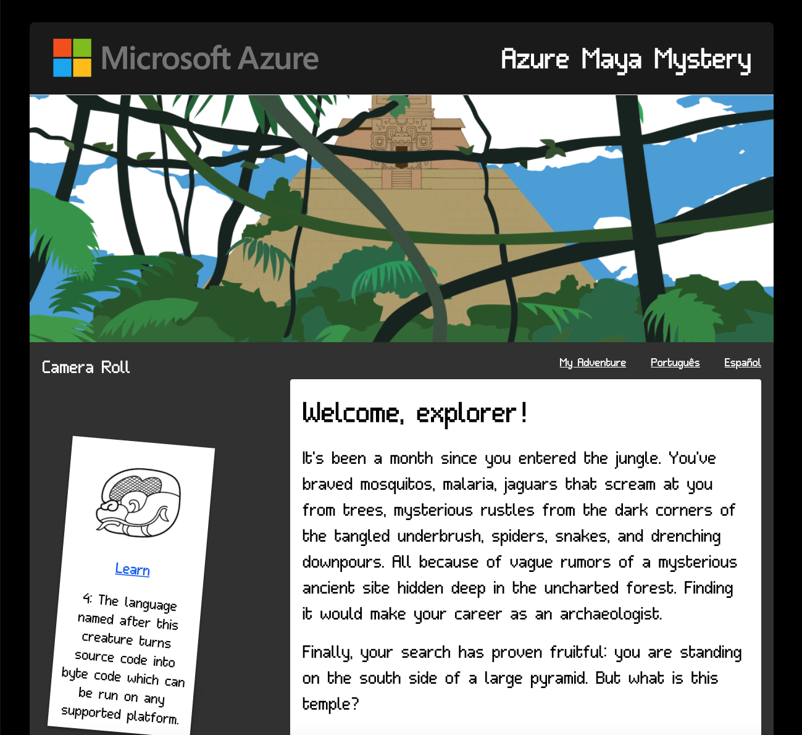

# Welcome to the Azure Maya Mystery!

[Explore the pyramid](https://microsoft.com/AzureMayaMystery?WT.mc_id=mayamystery-github-jelooper)

## Description

The Azure Maya Mystery is a project in the 'Mystery Experiences' family of web sites developed by Cloud Advocates at Microsoft, including Em Lazer-Walker, Jen Looper, and Chris Noring, amongst others. These text-based games are designed to showcase Microsoft Learn and Docs content in a new, fun, and engaging way.

The first iteration of these games was built using Twine with PlayFab as its backend. Visit the [Mystery Mansion](https://microsoft.com/mysterymansion?WT.mc_id=mysterymansion-github-jelooper) and earn the keys to unlock the deeds to the house! The project is described [here](https://dev.to/azure/the-making-of-the-azure-mystery-mansion-3ego).

The popularity and continued engagement of our audiences with the Mystery Mansion has led us to dream even bigger, and we proudly unveil our mysterious pyramid, deep in jungle, for you to explore!

In this experience, you will learn the meanings of many Maya glyphs, discover the structure of a Maya temple, learn the name of this special temple, discover the Goddess to whom it is dedicated, and restore some of its treasures to reach the summit and earn your reward.

The first part of the experience will be unveiled in July, 2020, and will focus on using Azure Static Web Apps to chat with a goddess who will help you get access into the temple. You will also unlock its door by learning the meanings of several May glyphs.

The second part, where we will explore the interior of the pyramid, will be unveiled in August, 2020, and the third part in September, 2020, where the users will attain the summit and discover the truth behind the pyramid.

## History of the Project

Inspiration comes from many different places, and it so happens that lead developer Jen's brother, [Matthew Looper](https://www.csuchico.edu/art/people/faculty/looper-matthew.shtml), is an eminent Mayanist at Cal State Chico. Together with his expertise, and using his contacts to find a wonderful illustrator, Dana Moot II, we were able to create a culturally-sensitive, yet amusingly gamified experience that will engage players of many ages while teaching a little about reading glyphs and encourage them to discover Microsoft Learn. We also leveraged our department's native speakers and the Microsoft Student Ambassador group to translate our content for Spanish and Portuguese speakers.

## Architecture

This site is a hybrid of a Vue.js Single Page Web App and a VuePress static site. Most written content is written using VuePress's markdown architecture, and the game elements are built as standard Vue.js app elements. The game is contained in the `/app` folder and the API where calls to PlayFab, the backend, are stored is in `/api`. The site is deployed on [Azure Static Web Apps](https://azure.microsoft.com/services/app-service/static/?WT.mc_id=mayamystery-github-jelooper#overview) but, due to redirection needs when moving the site to production, a separate Azure Function App is running for the API calls.

## The Internal Challenge

At one point in each game iteration, the user needs to complete a challenge involving code in some way. This pattern is based on our successful [25 Days Of Serverless](https://25daysofserverless.com/) challenges in 2019.

To run the game locally:

-   Fork the repo and in your terminal, assuming you have the Vue CLI installed, ensure your local dependencies are installed by running `npm i`. Then cd to the `/app` folder and run `npm run dev`. This will start a session on localhost:8080 and you can play the game; external API calls will be made to store your game progess on PlayFab.
-   Feedback? Please use the 'issues' tab.

Enjoy!
